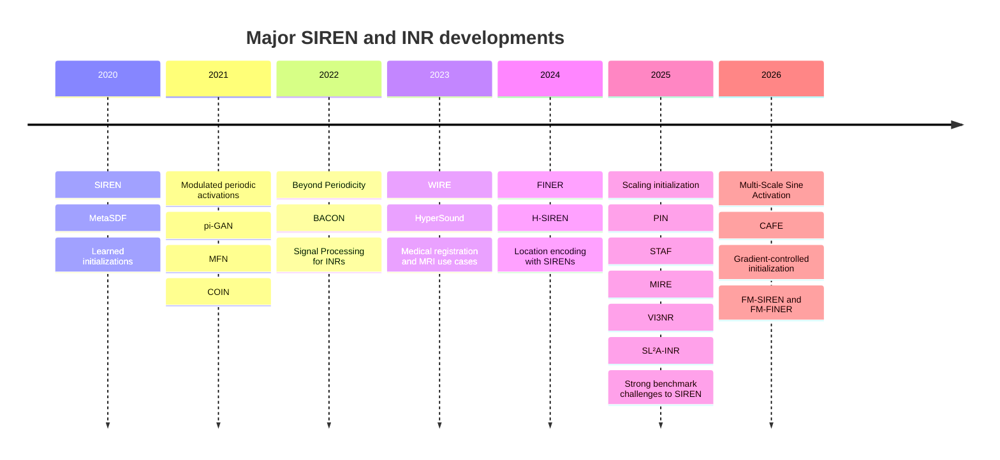

# SIREN and INR Research Since 2020

## Executive summary

SIREN’s lasting contribution was not just “replace ReLU with sine.” It established a practical design pattern for coordinate MLPs: use periodic activations, choose activation-aware initialization, and exploit exact derivatives as first-class outputs. That combination made implicit neural representations practical for images, video, audio, signed distance fields, and PDE-constrained inverse problems, and it became one of the main launch points for the modern INR literature. citeturn10view0turn11view0turn20search12turn27search0turn27search1

Over the last six years, follow-on work has split into several distinct directions. One line kept SIREN’s core idea but improved activation design or spectral control, leading to methods such as WIRE, FINER, H-SIREN, PIN, STAF, MIRE, SL²A-INR, and recent multi-scale or Nyquist-guided sinusoidal variants. A second line kept periodic activations but changed conditioning or training, including modulation, meta-learned initializations, hypernetworks, and improved initialization schemes. A third line used SIREN as a backbone in applications such as 3D-aware generation, compression, medical image registration, audio, microscopy, geospatial modeling, and control. A fourth line challenged SIREN directly, showing that some tasks can be matched or surpassed by alternatives such as localized wavelet activations, better-designed ReLU INRs, or even simple grids. citeturn31view0turn33view0turn35view0turn24search2turn13search5turn24search0turn25search6turn22search0turn22search2turn8search0turn20search3

The best-supported empirical conclusion is that vanilla SIREN remains a very strong baseline when you need smooth derivatives, compact coordinate regressors, or PDE-friendly representations, but it is no longer the default best choice. WIRE and FINER clearly outperform vanilla SIREN on several image fitting and inverse-problem benchmarks. Recent initialization papers show that a substantial part of SIREN’s observed weakness in some settings is training brittleness rather than fundamental lack of expressivity. At the same time, recent broader benchmarks show that the “SIREN is always best for INRs” story is false: strong ReLU-based INRs and grid representations can be better choices for some dense-signal, compression, and inverse-problem regimes. citeturn31view0turn32view0turn33view0turn34view1turn22search0turn20search20turn8search0turn20search3

For your own planned SIREN modifications, the highest-probability gains are not simply “more layers” or “larger hidden width.” The literature points to four more reliable levers: initialization and frequency control, localized or multi-scale activations, hybrid explicit-frequency front ends, and domain-specific regularization or conditioning. Your target domain is unspecified, so the most robust recommendations below are intentionally task-agnostic rather than optimized for one application area. citeturn33view0turn22search0turn22search2turn20search20turn25search2turn25search16

## Timeline of major developments

The timeline below focuses on influential or methodologically distinct SIREN/INR developments rather than every citing paper. It is strongest on primary sources and high-signal follow-ups. For 2025 to 2026, some frontier items are still preprints or under review, so treat those as promising rather than settled. citeturn27search0turn27search1turn18search0turn20search19

| Year | Key paper | What changed |
|---|---|---|
| 2020 | urlSIREN paperhttps://arxiv.org/abs/2006.09661 · urlcodehttps://github.com/vsitzmann/siren | Periodic activations plus principled initialization; showed image, video, audio, SDF, Poisson, Helmholtz, and wave-equation use cases. citeturn10view0turn11view0 |
| 2020 | urlMetaSDF paperhttps://arxiv.org/abs/2006.09662 · urlcodehttps://github.com/vsitzmann/metasdf | Meta-learning priors over neural fields; made INR fitting much faster at test time for shape reconstruction. citeturn5search1turn6search0 |
| 2020 | urlLearned Initializations paperhttps://arxiv.org/abs/2012.02189 | Learned initialization for coordinate networks; shifted focus from architecture alone to optimization start state. citeturn23search0 |
| 2021 | urlModulated Periodic Activations paperhttps://arxiv.org/abs/2104.03960 | Latent modulation of periodic activations for generalizable local functional representations. citeturn23search2 |
| 2021 | urlπ-GAN paperhttps://openaccess.thecvf.com/content/CVPR2021/html/Chan_Pi-GAN_Periodic_Implicit_Generative_Adversarial_Networks_for_3D-Aware_Image_Synthesis_CVPR_2021_paper.html · urlcodehttps://github.com/marcoamonteiro/pi-GAN | SIREN plus FiLM-style modulation inside a radiance-field GAN; major step for 3D-aware synthesis. citeturn28view0turn29view0 |
| 2021 | urlMFN paperhttps://openreview.net/forum?id=OmtmcPkkhT · urlcodehttps://github.com/boschresearch/multiplicative-filter-networks | Multiplicative filters as an alternative to sine or Fourier features. citeturn6search5turn6search2 |
| 2021 | urlCOIN paperhttps://arxiv.org/abs/2103.03123 | Put single-instance INR fitting, with SIREN as a core option, onto the compression map. citeturn30view0turn5search3 |
| 2022 | urlBeyond Periodicity paperhttps://arxiv.org/abs/2111.15135 | Argued sine is only one point in a broader activation family; emphasized initialization robustness. citeturn8search1 |
| 2022 | urlBACON paperhttps://arxiv.org/abs/2112.04645 · urlcodehttps://github.com/computational-imaging/bacon | Analytically band-limited, multi-scale INR architecture. citeturn8search2turn8search17 |
| 2022 | urlSignal Processing for INRs paperhttps://proceedings.neurips.cc/paper/2022/hash/575c450013d0e99e4b0ecf82bd1afaa4-Abstract-Conference.html · urlcodehttps://github.com/VITA-Group/INSP | Treated trained INRs as objects to process directly using differential operators. citeturn20search1turn20search16 |
| 2023 | urlWIRE paperhttps://arxiv.org/abs/2301.05187 · urlcodehttps://github.com/vishwa91/wire | Localized Gabor-wavelet activations; stronger robustness and faster convergence on many visual tasks. citeturn31view0turn32view0 |
| 2023 | urlHyperSound paperhttps://arxiv.org/abs/2302.04959 · urlcodehttps://github.com/WUT-AI/hypersound | Hypernetworks for audio INRs; moved beyond per-sample reoptimization. citeturn39search12turn39search0 |
| 2024 | urlFINER paperhttps://openaccess.thecvf.com/content/CVPR2024/html/Liu_FINER_Flexible_Spectral-bias_Tuning_in_Implicit_NEural_Representation_by_Variable-periodic_CVPR_2024_paper.html · urlcodehttps://github.com/liuzhen0212/FINER | Variable-periodic activation and bias-controlled spectral tuning. citeturn33view0turn34view1 |
| 2024 | urlH-SIREN paperhttps://arxiv.org/abs/2410.04716 | First-layer hyperbolic-periodic modification to improve high-frequency detail and fluid-flow tasks. citeturn35view0turn36search1 |
| 2025 | urlFast Training via Scaling Initialization paperhttps://arxiv.org/abs/2410.04779 | Showed simple weight scaling can make sinusoidal neural fields train about ten times faster. citeturn22search0turn22search3 |
| 2025 | urlPIN paperhttps://openreview.net/forum?id=Eh1QM3OK51 · urlprojecthttps://dsgrad.github.io/PIN/ | PSWF activation with strong space-frequency concentration. citeturn24search2turn24search8 |
| 2025 | urlSTAF paperhttps://arxiv.org/abs/2502.00869 · urlcodehttps://github.com/AlirezaMorsali/STAF | Trainable sinusoidal activations with learned frequency content. citeturn13search5turn13search2 |
| 2025 | urlMIRE paperhttps://openaccess.thecvf.com/content/CVPR2025/html/Jayasundara_MIRE_Matched_Implicit_Neural_Representations_CVPR_2025_paper.html | Layerwise activation matching from a learned dictionary. citeturn24search0turn26search3 |
| 2025 | urlVI3NR paperhttps://arxiv.org/abs/2504.19270 · urlcodehttps://github.com/Chumbyte/vi3nr | General variance-stable initialization across activations. citeturn22search2turn22search16 |
| 2025 | urlSL²A-INR paperhttps://arxiv.org/abs/2409.10836 · urlprojecthttps://moeinheidari7829.github.io/SL2A-INR/ | Learnable activation layer plus lightweight fusion network. citeturn25search12turn25search6 |
| 2025 | urlEnd-to-End INR Classification paperhttps://arxiv.org/abs/2503.18123 · urlcodehttps://github.com/SanderGielisse/MWT | Showed SIREN weight space can be useful downstream when trained end to end. citeturn14search14turn26search17 |
| 2026 | urlMulti-Scale Sine Activation paperhttps://ojs.aaai.org/index.php/AAAI/article/view/39305 | Parallel multi-frequency sine channels inside each layer. citeturn25search16 |
| 2026 | urlCAFE paperhttps://arxiv.org/abs/2603.01028 · urlcodehttps://github.com/JunboKe0619/CAFE | Hybrid explicit frequency synthesis with Fourier-Chebyshev features; strong 2026 baseline challenger. citeturn25search2turn25search5 |
| 2026 | urlGradient-controlled sinusoidal initialization paperhttps://openreview.net/forum?id=92d74WdgtG | Nyquist-aware initialization for SIREN and stronger gradient control. citeturn20search20turn22search23 |
| 2026 | urlFM-SIREN and FM-FINER paperhttps://openreview.net/forum?id=ZXJ74KEVUu | Neuron-specific periodic multipliers motivated by Nyquist sampling. citeturn7search9turn7search14 |

## Direct extensions and theoretical analyses

The compute and training-cost labels below are qualitative. Most INR papers do not report FLOPs or standardized wall-clock budgets consistently, and recent benchmarking work explicitly argues that fair comparisons remain an open issue. citeturn27search1turn20search3turn20search14

### Direct SIREN extensions and modifications

| Method | Year | Modification type | Tasks, datasets, metrics | Result relative to vanilla SIREN | Compute or training cost | Links |
|---|---:|---|---|---|---|---|
| SIREN | 2020 | Sine activations with activation-preserving initialization | Images, video, audio, SDFs, Poisson, Helmholtz, wave equations; PSNR, MSE, qualitative derivative fidelity | Baseline. Strongly beat ReLU, tanh, softplus and positional-encoding baselines in its original study; uniquely strong on derivatives and PDE tasks. citeturn10view0turn11view0turn20search12 | Moderate per-step cost, but sensitive to initialization and frequency settings | urlpaperhttps://arxiv.org/abs/2006.09661 · urlcodehttps://github.com/vsitzmann/siren |
| Modulated Periodic Activations | 2021 | Periodic synthesis network plus modulation network and local latent tiles | Images, videos, shapes; reconstruction fidelity and generalization quality | Improved generalization beyond single-signal fitting; important conceptual extension rather than pure head-to-head “beat SIREN everywhere.” citeturn23search2 | Higher than SIREN because of modulation network and latent code inference | urlpaperhttps://arxiv.org/abs/2104.03960 |
| π-GAN | 2021 | FiLM-conditioned SIREN radiance field inside GAN | CelebA, Cats, CARLA; FID, KID, IS | Strong positive result. FID improved from 41.1 to 14.7 on CelebA and from 28.9 to 16.8 on Cats versus GRAF; ablation showed sine plus mapping-network conditioning was critical. citeturn28view0turn29view0turn29view1 | Much higher training cost due to 3D GAN + volume rendering, partly offset by progressive growing | urlpaperhttps://openaccess.thecvf.com/content/CVPR2021/html/Chan_Pi-GAN_Periodic_Implicit_Generative_Adversarial_Networks_for_3D-Aware_Image_Synthesis_CVPR_2021_paper.html · urlcodehttps://github.com/marcoamonteiro/pi-GAN |
| Beyond Periodicity / Gauss | 2022 | Broader activation family, including Gaussian activations | Coordinate MLP fitting with sensitivity to initialization | Mixed but important. Claimed Gauss-like activations can be more robust to random initialization than sine while retaining high fidelity. citeturn8search1 | Similar model size; lower hyperparameter brittleness | urlpaperhttps://arxiv.org/abs/2111.15135 |
| WIRE | 2023 | Complex Gabor-wavelet activation | Kodak, DIV2K, Tiny ImageNet, CT, occupancy volumes, NeRF; PSNR, SSIM, LPIPS, IoU | Clear improvement on visual inverse problems. Example denoising figure reports 30.2 dB for WIRE versus 28.8 dB for SIREN, with similar or better SSIM, and roughly order-of-magnitude faster convergence to the same PSNR. citeturn31view0turn32view0turn32view2 | Slightly more complex activation, but lower time to quality | urlpaperhttps://arxiv.org/abs/2301.05187 · urlcodehttps://github.com/vishwa91/wire |
| FINER | 2024 | Variable-periodic activation with bias-controlled spectral tuning | 2D fitting, 3D SDFs, NeRF; PSNR, SSIM, LPIPS, Chamfer, IoU | Strong improvement. Image fitting PSNR 40.76 versus SIREN 38.52; Lego NeRF PSNR 30.04 versus 29.60; average 3D SDF Chamfer 3.087e-6 versus 3.438e-6. citeturn33view0turn34view1turn34view2turn34view4 | Similar architecture, modest extra init complexity | urlpaperhttps://openaccess.thecvf.com/content/CVPR2024/html/Liu_FINER_Flexible_Spectral-bias_Tuning_in_Implicit_NEural_Representation_by_Variable-periodic_CVPR_2024_paper.html · urlcodehttps://github.com/liuzhen0212/FINER |
| FINER++ | 2024 | Generalized variable-periodic framework for multiple backbones | 2D fitting, 3D SDFs, NeRF, streamable INR transmission | Positive follow-up. Extends FINER-style spectral tuning beyond sine and reports improvements over existing INR backbones. citeturn13search3turn38academia27 | Slightly higher implementation complexity | urlprojecthttps://liuzhen0212.github.io/finerpp/ |
| H-SIREN | 2024 | Replace first-layer sine with hyperbolic-periodic first layer `sin(sinh(2x))` | Vision tasks and fluid flow | Positive. Collected sources say it outperformed several state-of-the-art INRs with only minor extra overhead. citeturn35view0turn36search1 | Very small added cost | urlpaperhttps://arxiv.org/abs/2410.04716 |
| PIN | 2025 | Prolate spheroidal wave function activation | Signal representation tasks in INR benchmarks | Positive. Uses PSWF concentration to improve fine-scale fidelity and generalization beyond sine-only networks. citeturn24search2turn24search8 | Similar depth and width; activation more specialized | urlpaperhttps://openreview.net/forum?id=Eh1QM3OK51 · urlprojecthttps://dsgrad.github.io/PIN/ |
| STAF | 2025 | Trainable sinusoidal activation with learned frequency content | Signal representation and inverse problems; PSNR-focused evaluation | Positive but still recent. Reports faster convergence and higher reconstruction fidelity than prior methods. citeturn13search5turn13search8turn38search5 | Slightly higher parameter count and optimization complexity | urlpaperhttps://arxiv.org/abs/2502.00869 · urlcodehttps://github.com/AlirezaMorsali/STAF |
| MIRE | 2025 | Layerwise matched activation from a dictionary | Image representation, inpainting, 3D shape, NeRF, edge detection | Positive. The paper reports consistent gains over existing methods and removes exhaustive activation search. citeturn24search0turn26search3 | Higher than SIREN because of activation search or matching machinery | urlpaperhttps://openaccess.thecvf.com/content/CVPR2025/html/Jayasundara_MIRE_Matched_Implicit_Neural_Representations_CVPR_2025_paper.html |
| AINR | 2025 | Adaptive activation learning from a dictionary | Generic INR fitting | Positive in collected sources, but less mature than MIRE and not as broadly validated yet. citeturn24search1turn24search4turn26search2 | Higher training complexity due to adaptive activation selection | urlpaperhttps://openreview.net/forum?id=G4P1q2G0XK |
| SL²A-INR | 2025 | Single learnable activation layer plus lightweight ReLU fusion network | Image representation, 3D shape reconstruction, NeRF | Positive. Project page claims state-of-the-art across image representation, 3D shapes, and NeRF. citeturn25search6turn25search9turn26search16 | Slightly higher than plain SIREN | urlpaperhttps://arxiv.org/abs/2409.10836 · urlprojecthttps://moeinheidari7829.github.io/SL2A-INR/ |
| Multi-Scale Sine Activation | 2026 | Parallel sine channels with logarithmically spaced frequencies and amplitude modulation | Continuous-signal modeling and 3D SDF tasks | Positive in collected sources. Designed explicitly for multi-scale and high-frequency structure that plain sine layers miss. citeturn25search1turn25search16 | More channels, so higher per-layer cost | urlpaperhttps://ojs.aaai.org/index.php/AAAI/article/view/39305 |
| FM-SIREN and FM-FINER | 2026 | Neuron-specific Nyquist-informed frequency multipliers | Generic INR fitting | Promising frontier result. Claims reduced hidden-frequency redundancy and better capacity than fixed global multipliers. Publication status is still recent and should be treated cautiously. citeturn7search9turn7search14 | Similar depth; slightly more activation bookkeeping | urlpaperhttps://openreview.net/forum?id=ZXJ74KEVUu |
| WINNER | 2025 | Target-aware noisy initialization using spectral centroid | Audio fitting, image fitting, 3D shape fitting | Positive but frontier. Claims state-of-the-art audio fitting and significant gains over base SIREN by fixing spectral bottlenecks at initialization. citeturn14search4turn14search22turn7search16 | Same architecture, lower wasted training | urlpaperhttps://arxiv.org/abs/2509.12980 · urlcodehttps://github.com/hemanthgrylls/SIREN-square |

### Initialization and training-regime papers that matter even if they are not “new SIREN activations”

| Method | Year | Core idea | Main lesson for SIREN modification | Links |
|---|---:|---|---|---|
| Learned Initializations for Coordinate-Based Neural Representations | 2021 | Meta-learn an initialization so per-instance INR fitting converges faster on images, CT, scenes, and shapes | Initialization is often as important as activation choice. citeturn23search0turn23search3 | urlpaperhttps://arxiv.org/abs/2012.02189 |
| MetaSDF | 2020 | Gradient-based meta-learning for SDF priors | Learned priors can cut test-time optimization dramatically while retaining implicit-function benefits. citeturn5search1turn6search0 | urlpaperhttps://arxiv.org/abs/2006.09662 · urlcodehttps://github.com/vsitzmann/metasdf |
| Transformers as Meta-Learners for INRs | 2022 | Transformer hypernetwork predicts full INR weights | Stronger conditioning than single latent-vector modulation; relevant if your modified SIREN must generalize across signals. citeturn23search1turn23search4turn23search7 | urlpaperhttps://arxiv.org/abs/2208.02801 · urlcodehttps://github.com/yinboc/trans-inr |
| Fast Training of Sinusoidal Neural Fields via Scaling Initialization | 2025 | Multiply weights by a constant to improve conditioning and weaken spectral bias | High-value practical change if you want to keep a SIREN-like architecture but accelerate optimization. citeturn22search0turn22search3 | urlpaperhttps://arxiv.org/abs/2410.04779 |
| VI3NR | 2025 | Variance-stable initialization for arbitrary INR activations | Helps compare activation changes fairly and avoid blaming the activation for bad variance propagation. citeturn22search2turn22search6 | urlpaperhttps://arxiv.org/abs/2504.19270 · urlcodehttps://github.com/Chumbyte/vi3nr |
| A New Initialization to Control Gradients in Sinusoidal Neural Networks | 2026 | Nyquist-guided choice of `w0` and NTK-based gradient control | One of the strongest recent practical messages: `w0` should be tied to signal bandwidth, not treated as a magical default. citeturn20search20turn22search23 | urlpaperhttps://openreview.net/forum?id=92d74WdgtG |
| End-to-End INR Classification | 2025 | Jointly meta-learn SIRENs and learned learning-rate schemes for downstream tasks | If your modified SIREN is intended for representation learning rather than only fitting, optimization strategy matters a lot. citeturn14search14turn20search6 | urlpaperhttps://arxiv.org/abs/2503.18123 · urlcodehttps://github.com/SanderGielisse/MWT |

### Theoretical analyses of periodic activations and sinusoidal INRs

| Paper | Year | Core theoretical claim | Why it matters for SIREN work | Links |
|---|---:|---|---|---|
| Understanding Sinusoidal Neural Networks | 2022 | Expands sinusoidal MLPs as harmonic sums; hidden layers generate integer linear combinations of input frequencies | Explains why SIREN can represent rich spectra and why first-layer frequencies are disproportionately important. citeturn37search1turn37search16 | urlpaperhttps://arxiv.org/abs/2212.01833 |
| Simple initialization and parametrization of sinusoidal networks via their kernel bandwidth | 2023 | Simplified sinusoidal networks and showed the NTK behaves like an adjustable low-pass filter | Gives a kernel view of `w0` and bandwidth tuning, highly relevant for principled hyperparameter selection. citeturn7search24 | urlpaperhttps://openreview.net/forum?id=yVqC6gCNf4d |
| Implicit Neural Representations and the Algebra of Complex Wavelets | 2024 | Wavelet-INR analysis shows how high frequencies emerge from coarse first-layer approximations | Theoretical bridge from SIREN-style Fourier intuition to localized wavelet design such as WIRE. citeturn37search2turn37search8 | urlpaperhttps://arxiv.org/abs/2310.00545 |
| A Sampling Theory Perspective on Activations for INRs | 2024 | Sampling-theoretic analysis argues sinc activations are theoretically optimal under mild assumptions | Important because it challenges the idea that sine is intrinsically optimal. citeturn37search0turn38academia26 | urlpaperhttps://arxiv.org/abs/2402.05427 |
| WIRE | 2023 | Uses harmonic-analysis arguments and NTK intuition to justify Gabor-wavelet activations | Shows localized space-frequency concentration can be a more useful inductive bias than pure periodicity for many images. citeturn31view0turn32view0 | urlpaperhttps://arxiv.org/abs/2301.05187 |
| A New Initialization to Control Gradients in Sinusoidal Neural Networks | 2026 | Links initialization to training dynamics through NTK and to Nyquist frequency | Practical theory paper with unusually direct engineering consequences. citeturn20search20turn22search23 | urlpaperhttps://openreview.net/forum?id=92d74WdgtG |
| A Unified Theory of Sinusoidal Activation Families for INRs | 2026 | Organizes SIREN, trainable sinusoidal families, and NTK-based theory into one framework | Promising synthesis, but still under review in collected sources, so treat as frontier reading. citeturn38search1turn38search2 | urlpaperhttps://openreview.net/forum?id=ZDmBPYptbL |

## Applications and benchmarking

### Representative applications that used SIREN directly or as a central backbone

| Domain | Paper | Method summary, datasets, metrics | Result relative to vanilla SIREN | Links |
|---|---|---|---|---|
| General signal fitting and PDEs | SIREN | Original paper used images, video, audio, 3D SDFs, Poisson image editing, Helmholtz and wave equations; metrics included image PSNR and PDE MSE | Baseline and foundational. Particularly strong where derivatives are supervised or analytically needed. citeturn10view0turn11view0 | urlpaperhttps://arxiv.org/abs/2006.09661 |
| 3D shape priors | MetaSDF | Meta-learned INR priors for SDFs; test-time adaptation over shape classes | Not a “better activation,” but a better training regime for shape-space INRs. It matched auto-decoder accuracy while being about an order of magnitude faster at test time. citeturn5search1 | urlpaperhttps://arxiv.org/abs/2006.09662 · urlcodehttps://github.com/vsitzmann/metasdf |
| 3D-aware image synthesis | π-GAN | SIREN radiance field with FiLM conditioning; CelebA, Cats, CARLA; FID, KID, IS | Strong positive use case. Used SIREN because it produced sharper, more view-consistent radiance fields than ReLU alternatives in their setup. citeturn28view0turn29view0 | urlpaperhttps://openaccess.thecvf.com/content/CVPR2021/html/Chan_Pi-GAN_Periodic_Implicit_Generative_Adversarial_Networks_for_3D-Aware_Image_Synthesis_CVPR_2021_paper.html · urlcodehttps://github.com/marcoamonteiro/pi-GAN |
| Image compression | COIN | Per-image INR fitting then quantization; low-bit-rate image compression | Uses INR fitting as codec. Outperformed JPEG at low bit-rates but was not yet competitive with state-of-the-art learned codecs. citeturn30view0 | urlpaperhttps://arxiv.org/abs/2103.03123 |
| Multimodal compression | COIN++ | INR-based compression across multiple modalities | Extended the COIN idea beyond images; important for showing SIREN-like INRs are not only graphics tools. citeturn5search6turn5search12 | urlpaperhttps://openreview.net/forum?id=NXB0rEM2Tq&noteId=NFamJOQ5PI |
| Audio compression | Siamese SIREN | INR-based audio compression built around SIREN | Positive. Reported superior audio reconstruction fidelity with fewer parameters than previous INR architectures. citeturn14search0turn14search3 | urlpaperhttps://arxiv.org/abs/2306.12957 · urlcodehttps://github.com/lucala/siamese-siren |
| Audio generation and generalization | HyperSound | Hypernetwork produces audio INRs for unseen recordings; ECML 2023 | Important shift away from per-sample optimization. Reported quality comparable to state-of-the-art audio representations. citeturn39search12turn39search20 | urlpaperhttps://arxiv.org/abs/2302.04959 · urlcodehttps://github.com/WUT-AI/hypersound |
| Medical image registration | Implicit Neural Representations for Deformable Image Registration | Continuous deformation field represented by periodic-activation MLP; chest CT; registration metrics and regularization via analytical gradients | Positive adoption of SIREN-like activations for dense deformation fields. Strong motivation was differentiable regularization. citeturn5search8turn5search2 | urlpaperhttps://openreview.net/forum?id=BP29eKzQBu3 · urlcodehttps://github.com/MIAGroupUT/IDIR |
| Brain MRI registration | Exploring the performance of implicit neural representations for brain image registration | MRI deformation-field INR study in Scientific Reports | Positive exploratory validation that INRs are useful in registration; more about testing the paradigm than inventing a new SIREN. citeturn39search1 | urlpaperhttps://www.nature.com/articles/s41598-023-44517-5 |
| Medical super-resolution and denoising | Implicit neural representations for unsupervised super-resolution and denoising of 4D flow MRI | Time-varying 3D velocity-field super-resolution; synthetic measurements and a real clinical scan | Positive. The optimized SIREN outperformed state-of-the-art techniques for denoised and super-resolved 4D flow fields. citeturn14search25turn21search5 | urlpaperhttps://arxiv.org/abs/2302.12835 |
| Microscopy | Implicit neural representations in light microscopy | Intermediate-plane prediction and motion correction using sine-activation INRs | Positive use case; direct evidence that SIRENs are useful in optical imaging workflows. citeturn39search2turn39search5turn39search8 | urlpaperhttps://opg.optica.org/abstract.cfm?uri=boe-15-4-2175 |
| Neuroradiology and signals | Leveraging sinusoidal representation networks to predict fMRI signals from EEG | Simultaneous EEG-fMRI modeling with a SIREN front end | Reported to outperform a recent state-of-the-art model on the collected dataset. citeturn16search2turn18search12 | urlpaperhttps://arxiv.org/abs/2311.04234 |
| Geospatial ML | Geographic Location Encoding with Spherical Harmonics and Sinusoidal Representation Networks | Global location encoding; benchmarks in remote sensing, ecology, epidemiology style tasks | Important “beyond graphics” application. SIRENs were competitive alone and state of the art when combined with spherical harmonics. citeturn16search1turn16search7 | urlpaperhttps://arxiv.org/abs/2310.06743 · urlcodehttps://github.com/marccoru/locationencoder |
| Control | Guidance and Control Networks with Periodic Activation Functions | Periodic activations in guidance and control benchmarks | Positive but niche. Trained faster and achieved lower overall training error on three control scenarios. citeturn16search0turn16search6 | urlpaperhttps://arxiv.org/abs/2405.18084 |
| Graphics and materials | Implicit Neural Representation of Tileable Material Textures | Sinusoidal network with integer-frequency initialization and Poisson regularization for tileability | Positive use of SIREN-style periodicity in a domain where periodic structure is physically meaningful. citeturn17search1 | urlpaperhttps://arxiv.org/abs/2402.02208 |
| Robotics | CSDF-by-SIREN | SIREN-based configuration-space signed distance fields for motion planning and collision avoidance | Evidence that robotics use is emerging, but still much less mature than graphics and medical imaging in the collected sources. citeturn15search0turn15search20 | urlpaperhttps://www.scitepress.org/PublishedPapers/2025/137369/ |
| Video representation | Optical Flow Regularization of Implicit Neural Representations for Frame Interpolation | Enforces optical-flow constraints using SIREN video derivatives | Good example of derivative-aware video modeling, one of SIREN’s comparative advantages. citeturn21search20 | urlpaperhttps://da.lib.kobe-u.ac.jp/da/kernel/0100491805/0100491805.pdf |

### Benchmarking and evaluation papers that directly test SIREN against alternatives

| Paper | Year | What was evaluated | Main conclusion for SIREN users | Links |
|---|---:|---|---|---|
| SIREN original comparisons | 2020 | ReLU, tanh, softplus, positional encoding MLPs | SIREN substantially outperformed these baselines in its original setup and was the only one that reliably represented derivatives for PDE use cases. citeturn20search12turn10view0 | urlpaperhttps://arxiv.org/abs/2006.09661 |
| WIRE | 2023 | SIREN, Gauss, MFN, ReLU+PE on fitting and inverse problems | Plain periodicity is often too global; localized wavelet activations can improve robustness and speed. citeturn31view0turn32view0 | urlpaperhttps://arxiv.org/abs/2301.05187 |
| FINER | 2024 | PEMLP, Gauss, SIREN, WIRE on 2D fitting, 3D SDF, NeRF | Vanilla SIREN can be beaten by better spectral control without major architectural bloat. citeturn34view1turn34view2turn34view4 | urlpaperhttps://openaccess.thecvf.com/content/CVPR2024/html/Liu_FINER_Flexible_Spectral-bias_Tuning_in_Implicit_NEural_Representation_by_Variable-periodic_CVPR_2024_paper.html |
| ReLUs Are Sufficient for Learning INRs | 2024 | ReLU-only INR with added constraints versus common INR baselines | Strong challenge to the “periodic activations are necessary” narrative. ReLU can be state of the art if designed carefully. citeturn8search0 | urlpaperhttps://arxiv.org/abs/2406.02529 · urlcodehttps://github.com/joeshenouda/relu-inrs |
| Predicting the Encoding Error of SIRENs | 2024 | 300,000 trained SIRENs across hyperparameters and images | Reveals large hyperparameter sensitivity, especially for narrow SIRENs, and makes explicit how unstable “small SIREN” performance can be. citeturn20search14turn20search2 | urlpaperhttps://arxiv.org/abs/2410.21645 |
| Where Do We Stand with INRs | 2024 | Technical and performance survey with experiments across INR families | Important synthesis paper: activation choice matters, but so do encoding, network structure, and scalability trade-offs. citeturn27search1turn27search3 | urlpaperhttps://arxiv.org/abs/2411.03688 |
| Grids Often Outperform Implicit Neural Representation at Compressing Dense Signals | 2025 | Diverse INRs versus grid interpolants on 2D and 3D signals, tomography, SR, denoising, compression | Very important correction to hype. For some dense signals, simple grids are more efficient and stronger than INRs, including SIREN-family models. citeturn20search3turn7search5 | urlpaperhttps://openreview.net/forum?id=OZljvntsto |

## What the last six years actually say about SIREN

The INR field did not converge on “SIREN everywhere.” Instead, it converged on a more specific statement: SIREN is one especially useful point in a design space whose main axes are spectral coverage, spatial locality, initialization stability, conditioning, and multi-scale structure. The field increasingly moved from asking whether periodic activations help at all to asking which periodic or localized frequency basis is right for a signal class, how to initialize it, and whether explicit Fourier or grid structure should be injected. citeturn27search1turn31view0turn33view0turn24search2turn25search2

Three empirical trends are especially strong. First, localized or adaptive frequency mechanisms usually beat fixed global sine activations when signals have mixed smooth and sharp structure, nonstationarity, or noise. That is the common thread behind WIRE, FINER, PIN, MIRE, and SL²A-INR. Second, much of SIREN’s weakness in practice traces to initialization and optimization mismatch rather than a hard representation limit. The scaling-initialization, VI3NR, WINNER, and gradient-control papers all push in that direction. Third, broad benchmark papers increasingly warn that INR papers often compare architectures under non-equivalent optimization budgets, so headline gains must be interpreted carefully. citeturn32view0turn34view1turn24search2turn24search0turn25search6turn22search0turn22search2turn20search20turn14search4turn20search3turn27search1

Application adoption has also become quite patterned. SIREN remains especially attractive where exact derivatives are directly useful: PDE solvers, optical flow or motion constraints, SDFs, and registration fields. It is also common when the signal itself has meaningful oscillatory or periodic structure, as in audio, geospatial encodings, and tileable textures. In contrast, for highly localized visual inverse problems, the literature now leans toward wavelet or variable-periodic alternatives rather than plain SIREN. citeturn10view0turn21search20turn5search8turn14search2turn14search0turn16search1turn17search1turn31view0turn33view0

## Practical recommendations, reproducibility issues, and open problems

### Practical recommendations if you plan to modify SIREN

If your goal is a better general-purpose SIREN, the most defensible first experiment is not a new exotic architecture. It is a controlled baseline study with strict input normalization to a fixed coordinate box, fixed signal dynamic range, multiple random seeds, and a careful sweep of first-layer frequency and bias initialization. Multiple later papers effectively show that “bad SIREN” and “good SIREN” can differ a lot just because of initialization and bandwidth selection. citeturn11view0turn22search0turn22search2turn20search20turn20search14

If you want to stay close to sine activations, the highest-confidence modifications are these. Use a better initialization first: scaling initialization, VI3NR, or a Nyquist-guided `w0` strategy. Then test variable-periodic bias schemes in the FINER style, because they are low-complexity and repeatedly competitive. If your signals are spatially localized or noisy, replace plain sine with a localized activation, especially WIRE-like Gabor-wavelet structure, or at least test a hybrid first layer such as H-SIREN. If your signals are genuinely multi-scale, test either multi-scale sine channels or a hybrid explicit-frequency front end such as Fourier-Chebyshev features. citeturn22search0turn22search2turn20search20turn33view0turn31view0turn35view0turn25search16turn25search2

If your use case is conditional or multi-instance rather than single-instance overfitting, prioritize modulation or meta-learning over bare architecture changes. The strongest evidence here comes from Modulated Periodic Activations, MetaSDF, Transformers as Meta-Learners, π-GAN, and HyperSound. In those settings, changing how the network is conditioned often matters more than changing the pointwise nonlinearity. citeturn23search2turn5search1turn23search1turn28view0turn39search12

Because your target domain is unspecified, I would prioritize experiments in this order:  
first, initialization and coordinate normalization;  
second, FINER-style variable periodicity;  
third, WIRE or another localized activation;  
fourth, hybrid explicit-frequency encodings;  
fifth, conditional or hypernetwork variants if you need generalization across signals.  
That ordering follows the strongest and most repeated evidence in the collected literature, while keeping implementation risk reasonable. citeturn33view0turn31view0turn22search0turn22search2turn25search2

### Reproducibility issues

The main reproducibility problem in SIREN work is that papers often compare activations under different effective bandwidths, different coordinate normalizations, or different optimization budgets. That means some claimed “activation improvements” may partly reflect better tuning rather than deeper modeling gains. The encoding-error and broader benchmarking papers are especially useful warnings here. citeturn20search14turn20search3turn27search1

A second issue is that many later methods are only lightly ablated on compute. Some papers claim faster convergence but use different hidden widths, different first-layer scales, different numbers of sampled points per iteration, or different training curricula. WIRE and FINER are among the better comparative studies, but even there, standardized cross-paper cost accounting is still limited. citeturn32view2turn34view2turn27search1

A third issue is maturity. Several 2025 to 2026 methods are credible and well motivated, but some are still preprints, workshop submissions, or under review. For those, use the ideas as research hypotheses, not yet as canonical replacements for SIREN. citeturn38search1turn7search9turn14search4

### Open problems

The first open problem is frequency control without brittle heuristics. The field still lacks a universally accepted way to set first-layer frequencies, bias initialization, or neuron-wise frequency structure from data automatically. This issue appears in SIREN, FINER, newer initialization work, and predictive hyperparameter studies. citeturn11view0turn33view0turn20search20turn20search14

The second is locality and discontinuities. SIREN’s global periodicity can cause ringing or oversmoothing, and many follow-up methods can be read as attempts to repair exactly that. WIRE localizes, H-SIREN sharpens the first layer, MIRE matches activations to layers, and SL²A-INR learns a custom front end, but there is still no universally best solution. citeturn31view0turn35view0turn24search0turn25search6

The third is fair comparison against simpler alternatives. ReLU INRs and even grids can be surprisingly competitive or better, especially for dense-signal compression and some inverse problems. Any new SIREN variant should therefore be benchmarked not only against SIREN, WIRE, and FINER, but also against well-tuned ReLU baselines and strong grid methods. citeturn8search0turn20search3

The fourth is scaling. Much of the SIREN literature still revolves around per-signal overfitting rather than reusable models. Hypernetworks, modulation, and meta-learning are the main solutions so far, but scalability to large scenes, long videos, and scientific simulation data remains a core challenge. citeturn23search2turn23search1turn39search12turn27search0

### Open questions and limitations

This report is broad but still selective. It prioritizes primary sources and high-signal follow-ups over exhaustive coverage of every low-citation application paper. The 2025 to 2026 frontier is moving quickly, and some recent methods listed above may change venue status or release more complete code after the current date. Robotics and some medical-imaging subareas are less comprehensively covered here than graphics, compression, and activation-design papers because the strongest collected evidence was concentrated in the latter groups.

## Prioritized reading list

### Start here

1. urlSIREN paperhttps://arxiv.org/abs/2006.09661 and urlcodehttps://github.com/vsitzmann/siren. The baseline you still need to understand in full. citeturn10view0turn11view0  
2. urlNeural Fields in Visual Computing and Beyondhttps://arxiv.org/abs/2111.11426. Best broad conceptual map of neural fields. citeturn27search0  
3. urlWhere Do We Stand with INRshttps://arxiv.org/abs/2411.03688. Best recent technical and performance survey. citeturn27search1  
4. urlWIRE paperhttps://arxiv.org/abs/2301.05187. Best studied “localized alternative to SIREN.” citeturn31view0turn32view0  
5. urlFINER paperhttps://openaccess.thecvf.com/content/CVPR2024/html/Liu_FINER_Flexible_Spectral-bias_Tuning_in_Implicit_NEural_Representation_by_Variable-periodic_CVPR_2024_paper.html. Best low-overhead spectral-control extension of SIREN. citeturn33view0turn34view1  
6. urlSimple sinusoidal initialization via kernel bandwidthhttps://openreview.net/forum?id=yVqC6gCNf4d and urlGradient-controlled sinusoidal initializationhttps://openreview.net/forum?id=92d74WdgtG. Best theory-to-practice initialization papers. citeturn7search24turn20search20  

### Read next if you care about modifying SIREN rather than replacing it

7. urlFast Training of Sinusoidal Neural Fields via Scaling Initializationhttps://arxiv.org/abs/2410.04779. Strong practical optimization paper. citeturn22search0  
8. urlVI3NR paperhttps://arxiv.org/abs/2504.19270. Useful if you want clean comparisons across activations. citeturn22search2  
9. urlH-SIREN paperhttps://arxiv.org/abs/2410.04716. Minimal architectural change, potentially high payoff. citeturn35view0  
10. urlMIRE paperhttps://openaccess.thecvf.com/content/CVPR2025/html/Jayasundara_MIRE_Matched_Implicit_Neural_Representations_CVPR_2025_paper.html. Activation matching rather than hard-coded periodicity. citeturn24search0  
11. urlSL²A-INR paperhttps://arxiv.org/abs/2409.10836. Learnable activation front end with strong claims. citeturn25search12  
12. urlSTAF paperhttps://arxiv.org/abs/2502.00869. Trainable sinusoidal family, good if you want to stay in the periodic-activation regime. citeturn13search5  

### Read if your domain is application-driven

13. urlπ-GAN paperhttps://openaccess.thecvf.com/content/CVPR2021/html/Chan_Pi-GAN_Periodic_Implicit_Generative_Adversarial_Networks_for_3D-Aware_Image_Synthesis_CVPR_2021_paper.html for 3D-aware graphics and conditioning. citeturn28view0  
14. urlCOIN paperhttps://arxiv.org/abs/2103.03123 and urlCOIN++ paperhttps://openreview.net/forum?id=NXB0rEM2Tq&noteId=NFamJOQ5PI for compression. citeturn30view0turn5search6  
15. urlHyperSound paperhttps://arxiv.org/abs/2302.04959 and urlSiamese SIREN paperhttps://arxiv.org/abs/2306.12957 for audio. citeturn39search12turn14search0  
16. urlMIDL deformable registration paperhttps://openreview.net/forum?id=BP29eKzQBu3 and url4D flow MRI paperhttps://arxiv.org/abs/2302.12835 for medical imaging. citeturn5search8turn14search25  
17. urlGeographic location encoding paperhttps://arxiv.org/abs/2310.06743 for a strong non-graphics, non-medical, non-audio example. citeturn16search1  

### Read if your goal is to challenge your own SIREN assumptions

18. urlReLUs Are Sufficient for Learning INRshttps://arxiv.org/abs/2406.02529. Essential negative control against periodic-activation hype. citeturn8search0  
19. urlGrids Often Outperform Implicit Neural Representation at Compressing Dense Signalshttps://openreview.net/forum?id=OZljvntsto. Essential systems-level reality check. citeturn20search3  
20. urlPredicting the Encoding Error of SIRENshttps://arxiv.org/abs/2410.21645. Useful for understanding hyperparameter sensitivity before running large sweeps. citeturn20search14