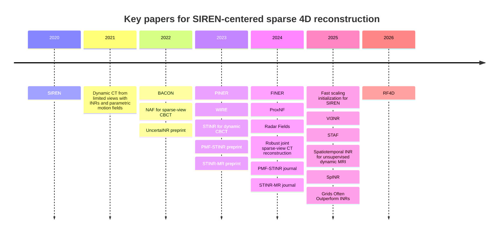
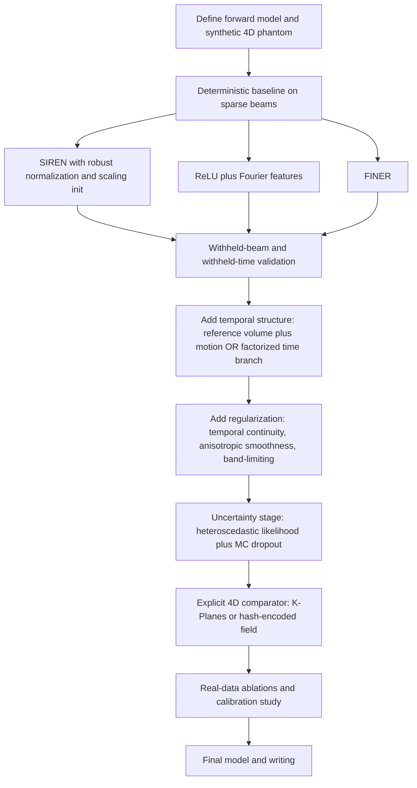

# Sparse 4D Implicit Neural Reconstruction for Multi-Beam Radar

## Executive summary

The closest mature literature to your problem is **not** generic neural rendering. It is the dynamic inverse-problem line in computed tomography and MRI: methods that reconstruct a continuous 3D volume over time from severely undersampled measurements, often using a spatial field plus a temporal or motion field. That is the branch with the strongest methodological overlap to sparse, irregular multi-beam radar tomography. The most relevant papers are the dynamic CT / CBCT line from 2021 onward, the dynamic MRI neural-field line from 2023 onward, and uncertainty-aware CT work such as UncertaINR. citeturn26view3turn36view0turn29view4turn29view5turn21search8turn7search7turn26view9

For backbone choice, the literature now points to a split answer. If you care most about smooth derivatives, stable physics losses, and clean continuous fields, SIREN and its descendants remain strong. If you care most about raw 4D fitting efficiency under tight compute or parameter budgets, you should not benchmark only periodic MLPs: recent work shows that explicit grids and factorized representations can beat same-size INRs on dense-signal tasks including tomography-like settings, and practical 4D representations such as K-Planes and TensoRF are now serious baselines. citeturn26view0turn28view4turn29view0turn29view6turn26view11turn29view9

The most defensible 10‑month path is therefore narrow and comparative: build one strong physics-based reconstruction framework, then compare **SIREN**, **FINER**, **ReLU+Fourier features**, and **one explicit 4D baseline** such as K-Planes or a hash-encoded coordinate MLP. Add uncertainty only after the deterministic baseline works. The uncertainty paper to copy first is UncertaINR, because it explicitly studies calibration for CT INRs and found that Monte Carlo dropout gave the best calibration among the tested Bayesian options. citeturn26view9turn29view6turn26view11turn29view9

The direct radar literature is much thinner. In the papers surfaced here, neural-field radar work is concentrated in automotive FMCW and SAR-style scene reconstruction, with physics-informed raw-radar supervision and, more recently, temporal modeling. Those papers are useful for forward-model design and frequency-domain parameterization, but they are **not** yet close substitutes for sparse 4D scientific radar tomography. citeturn29view7turn29view8turn23search10

## What the literature says and where radar fits

SIREN’s original contribution was not just “a sine MLP.” It established that periodic activations plus a specific initialization produce high-fidelity representations of signals **and their derivatives**, and it already included PDE and inverse-problem examples such as Helmholtz and full-waveform inversion. That is why SIREN still matters for scientific imaging: the derivative behavior is often more important than raw interpolation accuracy. Paper: urlNeurIPS paperturn4search8. Code: urlofficial repositoryturn15search7. citeturn26view0turn15search7

Over the next five years, the field split into three branches. One branch improved the periodic backbone itself, including BACON’s analytically band-limited filters, WIRE’s wavelet activations, FINER’s variable-periodic activations, better initialization papers such as VI3NR and scaling initialization, and newer trainable sinusoidal activations such as STAF. A second branch moved into inverse problems such as sparse-view CT, dynamic CBCT, dynamic MRI, and seismic full-waveform inversion. A third branch moved away from pure coordinate MLPs toward grids, factorized tensors, and plane decompositions for faster high-dimensional reconstruction. citeturn39academia10turn28view0turn28view4turn29view1turn29view0turn15search1turn29view6turn26view11turn29view9turn5search0

For your radar problem, the strongest analog is dynamic CBCT and dynamic MRI, because those papers reconstruct a 3D+time object from spatially incomplete measurements and repeatedly use one of two patterns: either a single spatiotemporal field, or a **reference volume + motion model** decomposition. The latter is especially important for sparse radar because it is usually easier to estimate a stable canonical field and a lower-dimensional temporal deformation than to fit a fully unconstrained 4D field directly. citeturn29view3turn36view0turn29view4turn29view5turn8search3

The strongest negative result you should take seriously is that more recent benchmarking work argues that simple regularized grids often train faster and to higher quality than parameter-matched INRs on dense 2D/3D signals, including tomography, denoising, and super-resolution. That does **not** kill SIREN for your use case, because your setting includes irregular sampling, continuous query points, and likely physics-based regularization. But it does mean your thesis should not be “SIREN versus nothing.” It should be “periodic coordinate MLPs versus one explicit/factorized 4D representation under the same forward model.” citeturn29view6

The timeline above reflects the practical branch point for your project: the field moved from “can periodic INRs work?” to “which representation is best under sparse inverse operators and 4D constraints?” citeturn26view0turn26view3turn39academia10turn26view9turn26view6turn36view0turn26view7turn26view8turn29view7turn29view2turn29view0turn26view15turn15search1turn21search8turn29view8turn29view6turn23search10

## High-priority paper map

### Directly relevant dynamic inverse-problem papers

- **Implicit Neural Representations with Periodic Activation Functions** by Vincent Sitzmann et al. (2020). Paper: urlNeurIPS paperturn4search8. Code: urlofficial repositoryturn15search7.  
  **Summary:** periodic coordinate-MLP with principled initialization; demonstrates image, audio, video, PDEs, and full-waveform inversion.  
  **Key result:** strong derivative fidelity and physics-facing inverse-problem capability.  
  **Limitation for sparse 4D radar:** no explicit treatment of heteroscedastic noise, irregular-beam observability, or contemporary 4D factorization.  
  **Relevance:** **high**, because it is still the cleanest derivative-friendly baseline. citeturn26view0turn15search7

- **Dynamic CT Reconstruction From Limited Views With Implicit Neural Representations and Parametric Motion Fields** by A. W. Reed et al. (2021). Paper: urlICCV paperturn3search3. Code: urlofficial repositoryturn8search11.  
  **Summary:** reconstructs continuous 4D CT from limited-view measurements using an INR plus parametric motion fields on the D4DCT benchmark.  
  **Key result:** reports PSNR/SSIM gains over baseline methods, and the coarse-to-fine motion-field regularization alone improved PSNR by about 6 dB in their ablation.  
  **Limitation for sparse 4D radar:** CT ray geometry is simpler and more regular than irregular beam sampling.  
  **Relevance:** **high**, because the reference-volume-plus-motion template is one of the best starting points for your case. citeturn26view3turn27view4turn27view5

- **NAF: Neural Attenuation Fields for Sparse-View CBCT Reconstruction** by Ruyi Zha et al. (2022). Project page: urlauthor project pageturn9search12. Code: urlofficial repositoryturn9search0.  
  **Summary:** sparse-view CBCT with a neural field and a tailored hash encoder rather than a sine backbone.  
  **Key result:** strong MICCAI-reviewed sparse-view CBCT performance with improved reconstruction quality and computation cost relative to iterative and earlier implicit-function baselines.  
  **Limitation for sparse 4D radar:** static, attenuation-based, and hash-grid oriented rather than derivative-oriented.  
  **Relevance:** **high** as the clearest inverse-problem example that a non-SIREN explicit encoder can be very competitive. citeturn8search2turn9search12turn9search0

- **PINER: Prior-Informed Implicit Neural Representation Learning for Test-Time Adaptation in Sparse-View CT Reconstruction** by Bowen Song et al. (2023). Paper: urlWACV paperturn8search5. Code: urlofficial repositoryturn8search1.  
  **Summary:** two-stage test-time adaptation for sparse-view CT with unknown noise, using INR to construct an adapted input and then enforce physical consistency.  
  **Key result:** specifically addresses unknown and varying noise without needing source training data or ground-truth test images.  
  **Limitation for sparse 4D radar:** intended for adapting a pretrained black-box CT model, not from-scratch scientific reconstruction.  
  **Relevance:** **medium-high**, especially if your beam statistics change across campaigns or operational modes. citeturn26view5turn8search1

- **UncertaINR: Uncertainty Quantification of End-to-End Implicit Neural Representations for Computed Tomography** by Francisca Vasconcelos et al. (TMLR 2023; arXiv 2022). Paper: urlOpenReview paperturn11search6. Code: urlofficial repositoryturn11search0.  
  **Summary:** Bayesian reformulation of CT INRs, comparing Bayes-by-backprop, HMC, MC dropout, and deep ensembles.  
  **Key result:** the paper reports competitive reconstruction quality with well-calibrated uncertainty and, notably, finds MC dropout best calibrated among the tested methods.  
  **Limitation for sparse 4D radar:** static CT, not dynamic 4D, and computational costs rise quickly for stronger Bayesian methods.  
  **Relevance:** **high**, because it is the most directly useful calibration paper in neural-field inverse problems. citeturn26view9turn11search0

- **Dynamic Cone-beam CT Reconstruction using Spatial and Temporal Implicit Neural Representation Learning** by You Zhang et al. (2023). Paper: urlarXiv paperturn19search2.  
  **Summary:** simultaneous spatial and temporal INRs for dynamic CBCT, augmented with a PCA motion model.  
  **Key result:** tumor tracking to an average center-of-mass error below 2 mm with relative reconstruction errors below 10%.  
  **Limitation for sparse 4D radar:** dependence on a prior patient-specific motion model is often unrealistic in radar tomography.  
  **Relevance:** **high** as the prototype for spatial-plus-temporal decomposition. citeturn29view3turn27view8

- **Dynamic CBCT Imaging using Prior Model-Free Spatiotemporal Implicit Neural Representation** by Hua-Chieh Shao et al. (journal 2024; arXiv 2023). Paper: urlarXiv paperturn35search3.  
  **Summary:** prior-free successor to STINR; learns spatial INR, temporal INR, and a B-spline motion model jointly in one shot from sequential projections.  
  **Key result:** robust dynamic CBCT reconstruction on phantoms, physical measurements, and multi-institutional patient data, with about 0.1 s temporal resolution and sub-millimeter motion accuracy.  
  **Limitation for sparse 4D radar:** no official code surfaced in this search, and the measurement operator is still X-ray forward projection rather than radar physics.  
  **Relevance:** **very high**, because this is the closest “3D volume plus time from very sparse measurements” paper I found. citeturn36view0

- **3D cine-magnetic resonance imaging using spatial and temporal implicit neural representation learning** by Hua-Chieh Shao et al. (2024). Paper: urlarXiv paperturn20search8.  
  **Summary:** joint reconstruction and deformable registration for undersampled 3D cine MRI, using a spatial INR for a reference image and a temporal INR for motion coefficients.  
  **Key result:** high temporal resolution below 100 ms and 3 mm spatial resolution, outperforming MR-MOTUS in image quality and tumor localization.  
  **Limitation for sparse 4D radar:** MRI k-space structure differs from sparse beam tomography, and no official code surfaced here.  
  **Relevance:** **high**, because it validates the reference-volume-plus-time-motion decomposition in another modality. citeturn29view4turn27view9

- **ProxNF: Neural Field Proximal Training for High-Resolution 4D Dynamic Image Reconstruction** by Luke Lozenski et al. (2024). Paper: urlarXiv paperturn18search1. Code: urlofficial repositoryturn18search12.  
  **Summary:** uses proximal splitting to separate the imaging operator from neural-field parameter updates, targeting large 4D problems.  
  **Key result:** demonstrated on 2D and 3D phantoms and in vivo dynamic contrast-enhanced photoacoustic tomography, specifically to reduce the memory/computational bottleneck of high-resolution 4D reconstruction.  
  **Limitation for sparse 4D radar:** not a sine-specific paper and not built around irregular sparse-beam geometry.  
  **Relevance:** **high**, because it directly attacks the computational bottleneck that a 4D radar INR will hit. citeturn29view5turn27view10turn18search12

- **Enhancing Dynamic CT Image Reconstruction with Neural Fields and Optical Flow** by Pablo Arratia et al. (2025). Paper: urlarXiv paperturn8search3. Code: urlofficial repositoryturn8search7.  
  **Summary:** adds explicit PDE-based motion regularization, specifically optical flow, to neural-field dynamic CT.  
  **Key result:** reports improvements over an unregularized neural-field counterpart and also states neural fields outperform a grid-based solver in their setup.  
  **Limitation for sparse 4D radar:** 2D+time CT rather than full 3D+time, and the motion prior is optical-flow style rather than physically grounded plasma evolution.  
  **Relevance:** **high**, because it is strong evidence that explicit temporal regularization matters. citeturn8search3turn8search19turn8search7

- **Implicit Neural Representations for Robust Joint Sparse-View CT Reconstruction** by Jiayang Shi et al. (2024). Paper: urlOpenReview paperturn8search0. Code: urlofficial repositoryturn8search4.  
  **Summary:** jointly reconstructs multiple similar CT objects with INRs so that common structure improves final quality, not just speed.  
  **Key result:** reframes joint INR learning as a quality-improving prior for sparse-view reconstruction.  
  **Limitation for sparse 4D radar:** needs related-object structure to exploit, which may or may not exist across radar time windows or events.  
  **Relevance:** **medium-high**, especially if you can treat neighboring times or repeated conditions as a correlated family. citeturn29view2turn8search4

- **Unsupervised reconstruction of accelerated cardiac cine MRI using neural fields** by Tabita Catalán et al. (journal 2025; arXiv 2023). Paper: urlarXiv paperturn7search7. Code: urlofficial repositoryturn7search3.  
  **Summary:** unsupervised cardiac cine MRI reconstruction with neural fields on retrospectively undersampled multi-coil radial acquisitions.  
  **Key result:** public code and reported reconstructions at aggressive undersampling factors, with the journal/repo materials describing experiments in the 13x to 26x range and the preprint highlighting very high acceleration.  
  **Limitation for sparse 4D radar:** MRI measurement physics and coil structure differ substantially from beam tomography.  
  **Relevance:** **high**, because it is a practical, code-available dynamic medical INR reconstruction baseline. citeturn7search7turn7search3

- **Spatiotemporal Implicit Neural Representation for Unsupervised Dynamic MRI Reconstruction** by Jie Feng et al. (TMI 2025). Paper index: urlPubMed entryturn21search8. Code: urlofficial repositoryturn21search0.  
  **Summary:** current code-available dynamic MRI INR paper from a medical-imaging lab, directly relevant if you want a modern spatiotemporal baseline beyond CT-style motion fields.  
  **Key result:** official code is public; the journal abstract was not fully surfaced in this search, but it is important as a living practical comparator.  
  **Limitation for sparse 4D radar:** incomplete abstract details surfaced here, so I would treat it as a code-first reading rather than a citation-first theory paper.  
  **Relevance:** **medium-high**. citeturn21search8turn21search0

### SIREN improvements and practical backbone papers

- **BACON: Band-limited Coordinate Networks for Multiscale Scene Representation** by David B. Lindell et al. (2022). Paper: urlCVPR paperturn39search3. Code: urlofficial repositoryturn39search0.  
  **Summary:** analytically band-limited coordinate network with multiscale outputs and constrained unsupervised behavior.  
  **Key result:** outperforms conventional single-scale coordinate networks in interpretability and quality, with official code.  
  **Limitation for sparse 4D radar:** designed more for controlled frequency behavior than for uncertainty or irregular observation geometry.  
  **Relevance:** **high** if you want coarse-to-fine or band-limited curricula. citeturn39academia10turn39search0

- **WIRE: Wavelet Implicit Neural Representations** by Vishwanath Saragadam et al. (2023). Paper: urlarXiv paperturn2search4.  
  **Summary:** replaces pure periodic activations with wavelet-style localized oscillatory activations.  
  **Key result:** the abstract explicitly claims new state of the art in INR accuracy, training time, and robustness across denoising, inpainting, super-resolution, CT reconstruction, image overfitting, and NeRF-style view synthesis.  
  **Limitation for sparse 4D radar:** no official code repository surfaced in this search, so practical adoption is less straightforward than FINER or BACON.  
  **Relevance:** **medium-high**. citeturn28view0turn28view2

- **FINER: Flexible Spectral-bias Tuning in Implicit NEural Representation by Variable-periodic Activation Functions** by Zhen Liu et al. (2024). Paper: urlCVPR paperturn2search13. Code: urlofficial repositoryturn15search3.  
  **Summary:** variable-periodic activations whose supported frequency set can be tuned through the initialization of the bias term.  
  **Key result:** on their 2D image-fitting benchmark, FINER reports PSNR 40.76 versus SIREN 38.52 and better SSIM/LPIPS as well, while also outperforming prior INRs on 3D SDFs and 5D radiance fields.  
  **Limitation for sparse 4D radar:** still a pure coordinate MLP, so 4D memory/optimization may remain difficult without factorization.  
  **Relevance:** **very high** as the strongest practical SIREN-family challenger with public code. citeturn28view4turn27view2turn15search3

- **Fast Training of Sinusoidal Neural Fields via Scaling Initialization** by Taesun Yeom et al. (2025). Paper: urlOpenReview paperturn30search6. Code: urlofficial repositoryturn32view0.  
  **Summary:** shows the standard SIREN/SNF initialization is suboptimal for training speed and proposes simple weight scaling.  
  **Key result:** the abstract claims about a 10x training-speed improvement, with code available through the lab’s neural-field repository.  
  **Limitation for sparse 4D radar:** a speed/optimization paper, not an inverse-problem or uncertainty paper.  
  **Relevance:** **high**, because 4D radar training time will matter immediately. citeturn29view0turn32view0

- **VI3NR: Variance Informed Initialization for Implicit Neural Representations** by Chamin Hewa Koneputugodage et al. (2025). Paper: urlCVPR paperturn14search12. Code: urlofficial repositoryturn30search1.  
  **Summary:** activation-aware initialization framework for different INR nonlinearities.  
  **Key result:** the paper reports large reconstruction differences induced by initialization alone, including image-reconstruction PSNR jumps across activations and much lower reconstruction error than random initialization in their controlled studies.  
  **Limitation for sparse 4D radar:** initialization helps, but it does not solve structural 4D inefficiency on its own.  
  **Relevance:** **medium-high**, especially if you compare several activation families fairly. citeturn29view1turn28view8turn30search1

- **STAF: Sinusoidal Trainable Activation Functions for Implicit Neural Representation** by Alireza Morsali et al. (2025). Paper: urlarXiv paperturn15search1. Code: urlofficial repositoryturn15search0.  
  **Summary:** trainable sinusoidal activations that adapt frequency content during learning; the paper includes inverse-problem experiments.  
  **Key result:** positioned as a more expressive, adaptive periodic family than fixed-frequency SIREN.  
  **Limitation for sparse 4D radar:** still preprint-stage in the surfaced material; I would treat it as exploratory rather than baseline-critical.  
  **Relevance:** **medium**. citeturn15search1turn15search0

- **H-SIREN: Improving implicit neural representations with hyperbolic periodic functions** (2024). Paper: urlarXiv paperturn30search5.  
  **Summary:** replaces the first-layer sine with a hyperbolic periodic function to address smoothing and limited supported frequencies.  
  **Key result:** the surfaced abstract claims improvements over several state-of-the-art INRs on vision and fluid-flow tasks.  
  **Limitation for sparse 4D radar:** no official code surfaced in this search, and the practical ecosystem is much weaker than FINER or scaling initialization.  
  **Relevance:** **medium-low**. citeturn30search5

### Radar, seismic, and neighboring physics papers

- **Implicit Seismic Full Waveform Inversion With Deep Neural Representation** by Jian Sun et al. (2023). Paper: urlJGR articleturn5search0.  
  **Summary:** uses an implicit neural representation for seismic velocity modeling within full-waveform inversion.  
  **Key result:** the surfaced journal material and abstract snippets emphasize robustness, generalization, and the ability to analyze uncertainty without extra calculations.  
  **Limitation for sparse 4D radar:** seismic wave propagation differs from multi-beam tomography, and no official code surfaced here.  
  **Relevance:** **medium**, because it is the closest physics-driven wave inverse-problem neighbor to radar. citeturn5search0turn5search4

- **Radar Fields: Frequency-Space Neural Scene Representations for FMCW Radar** by David Borts et al. (2024). Paper: urlarXiv paperturn24search0. Code: urlofficial repositoryturn24search5.  
  **Summary:** physics-informed neural scene reconstruction from raw FMCW radar measurements in Fourier frequency space, without optical volume rendering.  
  **Key result:** strong outdoor radar-scene reconstruction with a public codebase and an explicit radar forward model.  
  **Limitation for sparse 4D radar:** outdoor automotive scene reconstruction is not the same as ISR/radar volumetric field inversion.  
  **Relevance:** **medium-high**, mainly for forward-model design ideas. citeturn29view7turn24search5

- **SpINR: Neural Volumetric Reconstruction for FMCW Radars** by Harshvardhan Takawale and Nirupam Roy (2025). Paper: urlarXiv paperturn6search7.  
  **Summary:** frequency-domain differentiable forward model plus INR for volumetric FMCW radar reconstruction.  
  **Key result:** the abstract claims clear improvements over backprojection and existing learning-based approaches, framed as the first neural volumetric reconstruction method in this radar setting.  
  **Limitation for sparse 4D radar:** no official code surfaced here, and the problem setting is still scene geometry rather than scientific field reconstruction.  
  **Relevance:** **medium-high**, because it is the nearest direct radar inverse paper found. citeturn29view8

- **RF4D: Neural Radar Fields for Novel View Synthesis in Outdoor Dynamic Scenes** by Jiarui Zhang et al. (CVPR 2026). Project page: urlproject pageturn23search2. Repo placeholder: urlofficial repositoryturn23search6.  
  **Summary:** adds explicit temporal modeling to radar neural fields for dynamic scenes.  
  **Key result:** the abstract claims substantial gains in radar measurement synthesis and occupancy estimation in dynamic outdoor settings; the repo existed but said code would be released soon at the time surfaced here.  
  **Limitation for sparse 4D radar:** again, a rendering/synthesis setting rather than scientific inversion.  
  **Relevance:** **medium** for 4D temporal ideas, **low** for direct transfer. citeturn23search10turn23search6

## Candidate backbones for your first benchmark

The practical conclusion from the backbone literature is straightforward: do **not** compare only periodic MLP variants. Use one derivative-friendly periodic family and one explicit 4D family. The table below is a synthesis of the cited method papers and official codebases. citeturn26view0turn28view4turn29view0turn39academia10turn29view6turn26view11turn29view9

| Candidate backbone | Code availability | Spectral bias / frequency control | Training stability | Memory / compute | Suitability for sparse 4D radar | Recommended first step |
|---|---|---|---|---|---|---|
| SIREN citeturn26view0 | urlofficial codeturn15search7 | Very good high-frequency and derivative behavior | Sensitive to initialization, but well understood | Pure MLP, so 4D can get slow | Strong baseline if physics losses use gradients/Hessians | **Yes**. This should be baseline A |
| FINER citeturn28view4turn27view2 | urlofficial codeturn15search3 | Tunable via variable-periodic activation and bias initialization | Better practical flexibility than fixed-frequency SIREN | Same basic MLP cost as SIREN | Excellent SIREN-family challenger | **Yes**. Baseline B |
| ReLU + Fourier features / positional features citeturn26view0turn28view4 | No single canonical repo used here | Good, but less elegant than periodic activations for derivatives | Usually the easiest to optimize | Medium | Essential non-periodic comparator | **Yes**. Baseline C |
| BACON citeturn39academia10 | urlofficial codeturn39search0 | Explicit band-limiting and multiscale control | Good | Often more efficient than deep pure MLPs | Attractive if coarse-to-fine behavior matters | Optional after A/B/C |
| WIRE citeturn28view0turn28view2 | No official code surfaced in this search | Strong localized frequency behavior | Reported as robust | Medium | Interesting for noisy sparse reconstructions | Optional if you can reimplement cleanly |
| Hash-encoded coordinate MLP / tailored hash encoder citeturn8search2turn29view6turn13search0 | In this inverse-problem literature, the clearest surfaced example is urlNAF codeturn9search0 | Usually excellent raw local detail capacity | Often easy to optimize | Better scaling than pure MLPs, but more engineering | Very strong fidelity baseline if derivatives are secondary | **Yes**, if you have time for one explicit encoder baseline |
| Tensor-factorized / plane-factorized 4D fields such as K-Planes or TensoRF citeturn26view11turn29view9 | urlK-Planes codeturn7search0 and urlTensoRF codeturn7search5 | Explicit low-rank structure rather than implicit spectral control | Usually stable | Very attractive for 4D memory and speed | Probably the strongest 4D explicit comparator | **Yes**. Best “non-MLP” benchmark family |
| STAF / trainable sinusoidal activations citeturn15search1 | urlofficial codeturn15search0 | Adaptive periodic frequencies | Promising but less battle-tested | Similar to SIREN-class MLPs | Useful exploratory branch, not first baseline | Later-stage ablation |
| Scaling-initialized SIREN / SNF citeturn29view0 | urlofficial codeturn32view0 | Same function class as SIREN, lower optimization friction | Better than vanilla SIREN for speed | Same model size, less wall-clock pain | Very practical for 4D prototypes | Use this initialization in the SIREN baseline |

The main experimental bet I would make is: **SIREN or FINER will be the best derivative-consistent coordinate-MLP**, but **K-Planes or a hash-encoded coordinate model may win the fidelity-per-compute contest** once the domain becomes fully 4D and sparsely constrained. That is exactly the kind of result worth publishing if you keep the forward model and validation protocol fixed. citeturn28view4turn29view0turn29view6turn26view11turn29view9

## Recommended experimental sequence for a 10-month project

The scope should be framed as **sparse 4D scientific inverse reconstruction with uncertainty**, not “general INR research.” The right comparison is not every branch of the literature. It is one branch of inverse problems plus a small, disciplined backbone benchmark. Papers in dynamic CT and MRI repeatedly show that structure in time has to be modeled explicitly, either through motion, reference-frame decompositions, or regularized spatiotemporal coupling. citeturn26view3turn36view0turn29view4turn29view5turn8search3

### Baseline experiments

Start with a synthetic 4D phantom that matches your beam geometry and noise model. Do not begin on real data alone. Fit the reconstruction by minimizing a measurement-domain loss through the actual forward operator, then compare **three deterministic baselines first**: SIREN, ReLU+Fourier features, and FINER. Keep parameter count, optimizer, batch budgets, and training wall-clock as matched as possible. This directly reflects what the backbone literature and the dynamic inverse-problem papers suggest: the representation choice matters, but only when tested under the same inverse operator. citeturn26view0turn28view4turn29view0turn26view3turn36view0turn29view5

For coordinate and time normalization, test at least three settings: full normalization of \((x,y,z,t)\) to \([-1,1]\); separate scaling of time relative to space; and a reference-volume-plus-motion parameterization where time is not treated symmetrically with space. The CT/MRI papers repeatedly separate spatial and temporal components rather than throwing everything into a single undifferentiated 4D MLP, and that is probably the right bias for sparse radar too. I would test a static field \(f_\theta(x,y,z)\) plus a time conditioner \(g_\phi(t)\) before committing to a monolithic 4D MLP. citeturn29view3turn36view0turn29view4turn7search7turn21search8

After that, add **one explicit 4D comparator**. My first choice would be K-Planes if you want a clean low-rank spacetime factorization, or a hash-encoded coordinate model if you want to maximize raw fitting strength. If time or implementation budget is tight, K-Planes is the more defensible publication baseline because it is explicitly designed for higher-dimensional scenes and comes with official code. citeturn26view11turn7search0turn29view9turn8search2turn9search0turn29view6

### Regularizers to implement first

The first regularizer should be **temporal continuity**. The second should be **structured temporal modeling**, ideally a reference state plus motion or temporal coefficients. The third should be **anisotropic smoothness**, where weakly observed directions are regularized more strongly than well-observed directions. The literature strongest on this point is dynamic CT: motion-aware formulations and optical-flow regularizers improve reconstructions over plain spatiotemporal fitting, and prior-free CBCT methods still rely on structured motion models rather than unconstrained 4D fields. citeturn26view3turn36view0turn8search3turn29view5

If you want a frequency-control regularizer, the cleanest practical options are either BACON-style band-limiting or a coarse-to-fine curriculum where you begin with low temporal frequency and only later unlock higher temporal bandwidth. FINER is also attractive here because its whole point is explicit control over supported frequencies. For a radar field that is sparse in time and irregular in space, this is much more defensible than trying to let a fully expressive 4D MLP discover everything from the start. citeturn39academia10turn28view4turn29view0

On the data term, I would not start with a plain homoscedastic \(\ell_2\) loss. Use a heteroscedastic Gaussian or robust residual model from the start if your beam noise or uncertainty varies strongly across beams, ranges, or times. This is a direct extension of the uncertainty logic in UncertaINR and of the practical “unknown noise” orientation seen in PINER. citeturn26view9turn26view5

### Uncertainty methods to implement first

The first uncertainty layer should be **heteroscedastic aleatoric uncertainty**, implemented as either a variance head on the reconstruction or a measurement-domain variance model tied to beams and time. That gives you uncertainty-aware weighting almost for free and will likely stabilize training under uneven beam quality. This part is inference from the CT uncertainty literature, but it is strongly supported by the fact that calibration and noise mismatch are central failure modes in inverse-problem INRs. citeturn26view9turn26view5

The first epistemic method should be **MC dropout**, not HMC and not a heavy Bayesian neural network. UncertaINR explicitly compared several options and found MC dropout the best calibrated in that CT setting, while also being the cheapest of the serious options. After that, if compute allows, run a **small deep ensemble** as a sanity check on major experiments only. citeturn26view9turn11search0

I would delay more ambitious uncertainty methods until after the deterministic benchmark is settled. The direct literature on calibrated uncertainty for dynamic 4D neural-field inverse problems is still thin; spending months on approximate Bayesian machinery before you know whether the structural model is right is not the best use of time. citeturn26view9turn29view5turn36view0

### Validation protocols

Your validation should be more stringent than most of the INR reconstruction literature. I would use four holdout protocols from the start:

1. **Withheld-beam validation**: remove a subset of beams or beam directions entirely from training and predict them.  
2. **Withheld-time validation**: remove contiguous time windows, not random frames, so you test interpolation and mild extrapolation separately.  
3. **Joint beam-time holdout**: hardest case; this best proxies “poor observability” regions.  
4. **Noise-stress validation**: train and test under different noise levels or noise anisotropy.  

This is the right protocol if your eventual claim involves observability and uncertainty, because it best exposes where the model is interpolating versus hallucinating. The literature closest to this need is UncertaINR for calibration, plus the dynamic CT/MRI papers that explicitly confront under-sampled spatiotemporal reconstruction. citeturn26view9turn26view3turn36view0turn29view4turn29view5

For metrics, use one group for reconstruction, one for withheld-measurement prediction, and one for calibration. Reconstruction can be RMSE/MAE and, if you have synthetic truth, PSNR and SSIM. Prediction should include beam-domain residuals on held-out measurements. Calibration should include interval coverage, negative log-likelihood, and standardized residual diagnostics. If possible, add a spatial or spacetime “observability map” built from held-out error density rather than beam-count density alone. That last step is an inference-based recommendation, but it is what makes the calibration paper relevant to your actual scientific use case. citeturn26view9turn36view0turn29view5

## Prioritized reading list

### Read first

1. **Dynamic CBCT Imaging using Prior Model-Free Spatiotemporal Implicit Neural Representation**. The closest paper to your problem formulation. Paper: urlarXivturn35search3. citeturn36view0  
2. **Dynamic CT Reconstruction From Limited Views With Implicit Neural Representations and Parametric Motion Fields**. Still one of the clearest 4D sparse-view templates. Paper: urlICCVturn3search3. Code: urlGitHubturn8search11. citeturn26view3turn27view4  
3. **UncertaINR**. Your uncertainty/calibration blueprint. Paper: urlOpenReviewturn11search6. Code: urlGitHubturn11search0. citeturn26view9  
4. **FINER**. The strongest practical SIREN-family competitor with code. Paper: urlCVPRturn2search13. Code: urlGitHubturn15search3. citeturn28view4turn27view2  
5. **K-Planes**. Best explicit 4D comparator to periodic MLPs. Paper: urlCVPR paperturn7search16. Code: urlGitHubturn7search0. citeturn26view11  
6. **Grids Often Outperform Implicit Neural Representations**. Read this early so the benchmark is honest. Paper: urlarXivturn12search6. citeturn29view6

### Read next

7. **STINR-MR** for the MRI-side version of spatial-temporal decomposition. Paper: urlarXivturn20search8. citeturn29view4turn27view9  
8. **ProxNF** for optimization/memory design in 4D. Paper: urlarXivturn18search1. Code: urlGitHubturn18search12. citeturn29view5turn18search12  
9. **NAF** for a strong non-sine inverse-problem baseline using a hash-style encoder. Project: urlproject pageturn9search12. Code: urlGitHubturn9search0. citeturn8search2turn9search0  
10. **BACON** for band-limiting and multiscale design. Paper: urlCVPRturn39search3. Code: urlGitHubturn39search0. citeturn39academia10turn39search0  
11. **Fast Training of Sinusoidal Neural Fields via Scaling Initialization** for a faster SIREN baseline. Paper: urlOpenReviewturn30search6. Code: urlGitHubturn32view0. citeturn29view0turn32view0  
12. **Radar Fields** for forward-model ideas in radar. Paper: urlarXivturn24search0. Code: urlGitHubturn24search5. citeturn29view7turn24search5

### Read only if the project goes well

13. **SpINR** for direct radar volumetric INR ideas. Paper: urlarXivturn6search7. citeturn29view8  
14. **WIRE** if you want to explore wavelet activations under noise. Paper: urlarXivturn2search4. citeturn28view0  
15. **STAF**, **VI3NR**, and **H-SIREN** as activation/init ablations after the core benchmark is working. Papers: urlSTAF arXivturn15search1, urlVI3NR CVPRturn14search12, urlH-SIREN arXivturn30search5. citeturn15search1turn26view15turn30search5

## Open questions and limitations

The main limitation of the current literature is that **I did not surface an exact match** to sparse, irregular, multi-beam ISR/radar reconstruction of a 3D volume over time using SIREN. The closest high-confidence matches are dynamic CBCT and dynamic MRI on the inverse-problem side, and FMCW radar neural fields on the sensing-model side. That means part of your contribution can legitimately be problem formulation and evaluation protocol, not only a new network. citeturn36view0turn29view4turn29view7turn29view8

The second limitation is code coverage. The strongest code availability is in SIREN, FINER, BACON, K-Planes, TensoRF, NAF, PINER, ProxNF, NF-cMRI, the dynamic MRI TMI codebase, and Radar Fields. For WIRE and H-SIREN, I did not surface an official code repository in this search. For PMF-STINR, STINR, STINR-MR, and the seismic IFWI paper, I did not surface official code either. citeturn15search7turn15search3turn39search0turn7search0turn7search5turn9search0turn8search1turn18search12turn7search3turn21search0turn24search5turn30search5

The third limitation is uncertainty. UncertaINR is strong, but the literature is still sparse on **dynamic 4D neural-field inverse problems with calibrated uncertainty under withheld-view or withheld-time protocols**. That gap is real, and it is also an opportunity: a careful study of heteroscedastic likelihoods, MC dropout, held-out beam validation, and calibration in sparse 4D radar INR reconstruction would be well aligned with what is currently missing. citeturn26view9turn36view0turn29view5